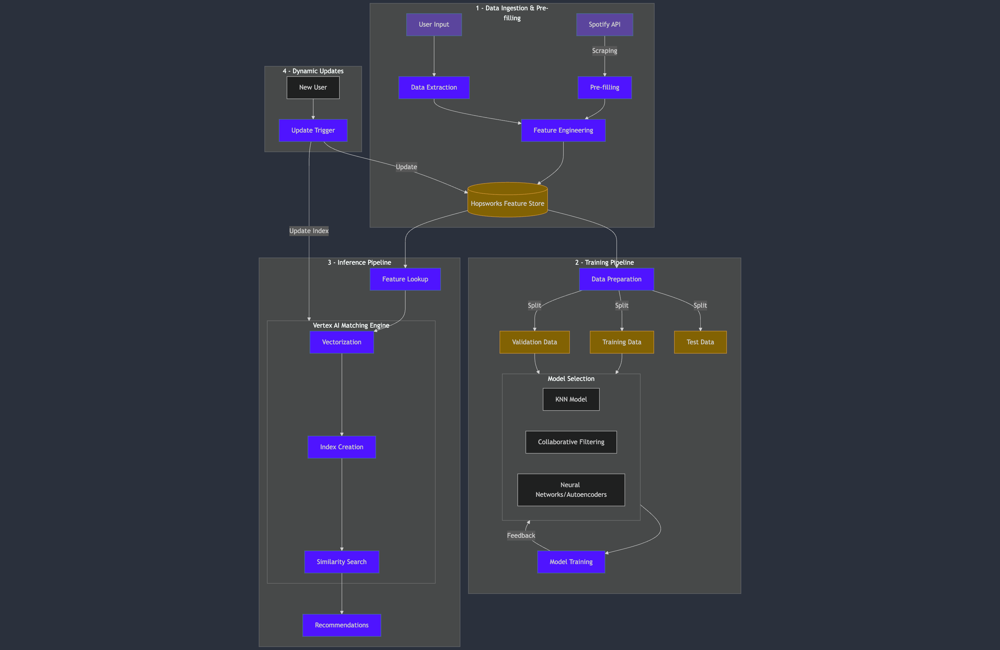

# ID2223 - Final project

## Project Architecture
### **1. Data Ingestion & Feature Extraction**
- **Spotify Profile Scraping**:
    - **Goal:** Collect Spotify user profiles using the API, ensuring compliance with Spotify’s terms.
    - **Feature Extraction**: 
        - **Genres**: Extracted from artist data, encoded with a SentenceTransformer, and averaged across playlists.
        - **Artists**: Top `N` most frequent artists are encoded and averaged.
        - **Release Years**: Average release year of tracks.
        - **Playlist Features**: 
            - Number of tracks
            - Average popularity
            - Explicitness ratio
        - **Playlist Embedding**: Weighted genre embeddings based on playlist size.
    - **Final User Embedding**: Combines **Genres**, **Artists**, **Playlists**, and **Release Years** into a single user representation.

- **Feature Engineering:**
    - **Embedding Creation:** Use the *User Profile Embedding* ([see this](./documentation/user_profile_embedding.md)) process based on a two-tower neural network architecture.
    - **Storage:** Store computed embeddings and metadata in **Hopsworks Feature Store** (or **Hopsworks Vector DB**) for efficient management.

### **2. Embedding Pipeline**
- **Pipeline Objective:** Automate the ingestion, embedding, and storage process for Spotify profiles.
    - Scrapes playlists and tracks for a list of Spotify profile URLs or IDs.
    - Extracts audio features and genres for each track.
    - Use an embedding logic using a two-tower architecture to encode user profiles effectively.
    - Store user embeddings and associated metadata in Hopsworks for downstream use.

### **3. Training Pipeline**
- **Data Preparation:**
    - Use prefilled data stored in Hopsworks for training.
    - Split data into training, validation, and test sets.
    - Normalize features for consistency.
- **Two-Tower Retrieval Model:**
    - Train the two-tower neural network model to generate embeddings for matching users.
    - Optimize hyperparameters and evaluate performance using validation data.
- **Model Storage:**
    - Save the trained two-tower model for later inference and recommendations.

### **4. Recommendation Pipeline**
- **Pipeline Objective:** Enable real-time user recommendations based on Spotify profile data.
    - **Embedding Generation:** For a new user:
        - Scrape their playlist data.
        - Extract features and generate embeddings using the embedding pipeline.
    - **Similarity Search:** Use the trained two-tower model to:
        - Retrieve embeddings of existing users from Hopsworks.
        - Compute similarities and find the closest profiles.
    - **Output:** Provide personalized recommendations, including metadata such as matching music genres.

### **5. Dynamic Data Updates**
- **Automated Updates:** Trigger updates when new users are added.
    - Update Hopsworks Feature Store with new embeddings.
    - Incrementally update the similarity index to ensure fresh recommendations.

### **6. User Interface (UI)**
- **User Input:** Allow users to enter their Spotify profile URL or ID.
- **Recommendation Trigger:** Use the recommendation pipeline to fetch similar profiles.
- **Enhanced Feedback:** Display the closest matches with additional details such as overlapping music genres, top tracks, etc.

### **Diagram Reference**
The architecture workflow is illustrated in the diagram below:  

## Roadmap :
See details [here](./documentation/roadmap.md)

- Task 1: **done**
- Task 2: **done**
- Task 3: **done**
- Task 4: **done**
- Task 5: **done**
- Task 6: _Not done_
- Task 7: _Not done_

## Useful links
- https://www.hopsworks.ai/dictionary/two-tower-embedding-model
- https://www.hopsworks.ai/news/making-hopsworks-a-more-modular-platform-with-delta-lake-support
- https://github.com/decodingml/personalized-recommender-course/tree/main
- https://developer.spotify.com/documentation/web-api
- https://cloud.google.com/blog/products/ai-machine-learning/scaling-deep-retrieval-tensorflow-two-towers-architecture
- https://medium.com/codex/similarity-search-of-spotify-songs-using-gcp-vector-search-vertex-ai-python-sdk-in-15-minutes-621573cd7b19
- https://slides.com/kirillkasjanov/recommender-systems#/3/6