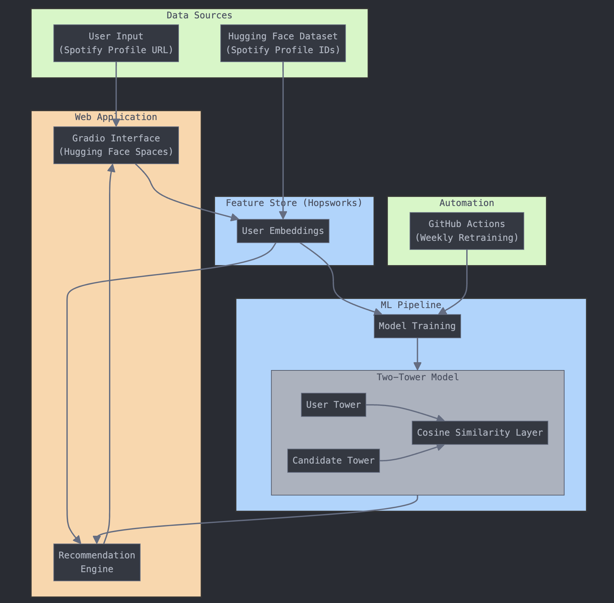

# Project Overview: Dynamic Spotify User Recommender System

This project demonstrates a **dynamic recommendation system** for Spotify users, built using a **multi-embedding deep learning architecture (Torch-based)**, **Hopsworks Feature Store**, and an interactive **Gradio web application**. The project uses advanced machine learning and data engineering techniques to deliver personalized user recommendations. The recommendation model and database are continuously updated with new data to ensure adaptability and improved personalization.

## Project Architecture Diagram
[](./documentation/project-architecture-v2.png)

## Key Components

### 1. **Dataset and Feature Store Integration**

The recommendation system uses a **dataset of Spotify profile IDs** sourced from **Hugging Face**. This dataset contains diverse user profile data, which is processed into embeddings for user preferences. These embeddings are stored in the **Hopsworks Feature Store**, providing a centralized repository of user data.

The user embeddings are processed to include data on **genres, artists, playlists, and release years**. These embeddings are later retrieved for model training and inference.

**Code Example: Retrieving User Embeddings**
```python
user_embeddings_fg = fs.get_feature_group(
    name='spotify_user_embeddings',
    version=2,
)

user_embeddings_df = user_embeddings_fg.read()
print(f"A total of {len(user_embeddings_df)} user embeddings are available.")
user_embeddings_df.head()
```

### 2. **Multi-Embedding Model Architecture**

The new recommendation model employs a **multi-embedding deep learning architecture** built with **PyTorch**. The system processes **three distinct embeddings**—genre, artist, and playlist embeddings—independently through separate towers, followed by a **joint tower** to compute a unified user embedding.

The final embeddings are compared using **cosine similarity** to generate user recommendations.

**Code Example: Multi-Embedding Architecture**
```python
class Tower(nn.Module):
    def __init__(self, input_dim, output_dim):
        super(Tower, self).__init__()
        self.fc = nn.Sequential(
            nn.Linear(input_dim, 128),
            nn.ReLU(),
            nn.Linear(128, output_dim)
        )

    def forward(self, x):
        return self.fc(x)

class TwoTowerModel(nn.Module):
    def __init__(self, embedding_dim, output_dim):
        super(TwoTowerModel, self).__init__()
        self.genre_fc = Tower(input_dim=embedding_dim, output_dim=output_dim)
        self.artist_fc = Tower(input_dim=embedding_dim, output_dim=output_dim)
        self.playlist_fc = Tower(input_dim=embedding_dim, output_dim=output_dim)
        self.fc_merge = nn.Sequential(
            nn.Linear(output_dim * 3, 128),
            nn.ReLU(),
            nn.Linear(128, output_dim)
        )

    def forward(self, genre, artist, playlist):
        genre_embed = self.genre_fc(genre)
        artist_embed = self.artist_fc(artist)
        playlist_embed = self.playlist_fc(playlist)
        combined = torch.cat([genre_embed, artist_embed, playlist_embed], dim=-1)
        return self.fc_merge(combined)
```

This modular architecture allows for independent processing of different embedding types and a seamless combination for final recommendation tasks.

### 3. **Training and Loss Function**

The system uses a **CosineEmbeddingLoss** function to train the model. Positive and negative user pairs are generated dynamically during training. A margin-based loss is optimized to improve the similarity computation of user embeddings.

**Code Example: Loss Function and Training Loop**
```python
criterion = nn.CosineEmbeddingLoss()
optimizer = torch.optim.Adam(model.parameters(), lr=1e-4, weight_decay=1e-5)

for epoch in range(100):
    total_loss = 0
    for user_ids, genres, artists, playlists in train_loader:
        genres = torch.tensor(genres.tolist(), dtype=torch.float32)
        artists = torch.tensor(artists.tolist(), dtype=torch.float32)
        playlists = torch.tensor(playlists.tolist(), dtype=torch.float32)

        # Generate negative samples
        neg_genres, neg_artists, neg_playlists = negative_sample(len(genres), df)

        positive_embed = model(genres, artists, playlists)
        negative_embed = model(neg_genres, neg_artists, neg_playlists)

        labels = torch.ones(positive_embed.size(0))
        loss = criterion(positive_embed, negative_embed, labels)

        optimizer.zero_grad()
        loss.backward()
        optimizer.step()

        total_loss += loss.item()
    print(f"Epoch {epoch + 1}, Loss: {total_loss}")
```

This setup ensures that the model learns robust embeddings for user profiles, improving recommendation accuracy.

### 4. **Dynamic User Integration into the Feature Store**

The system is designed to be **dynamic**: when a new user interacts with the **Gradio app**, their profile is processed, and embeddings are generated using their Spotify data. These embeddings are then **added to the Hopsworks Feature Store**.

This process enables the system to grow and improve continuously, as new data contributes to both the **recommendation model** and the **feature database**.

**Code Example: Adding User Embeddings to Feature Store**
```python
user_embedding_dict = {
    "user_id": user_id,
    "genre_embedding": genre_embedding.tolist(),
    "artist_embedding": artist_embedding.tolist(),
    "playlist_embedding": playlist_embedding.tolist(),
}
user_embedding_df = pd.DataFrame([user_embedding_dict])

feature_store = project.get_feature_store()
feature_group = feature_store.get_feature_group(name="spotify_user_embeddings", version=2)
feature_group.insert(user_embedding_df)
print(f"User embedding for {user_id} added successfully.")
```

### 5. **Interactive Gradio Web App**

The **Gradio web app** provides a simple and intuitive interface for users to generate recommendations. Users input their **Spotify profile URL**, and the system computes recommendations based on playlists, genres, and artists.

The app is hosted on **Hugging Face Spaces** for easy accessibility:  
[Spotify Profile Recommender - Gradio App](https://huggingface.co/spaces/minifixio/ID2223-final-project)

**Code Example: Gradio App Integration**
```python
interface = gr.Interface(
    fn=recommend_users,
    inputs=[
        gr.Textbox(label="Spotify Profile URL"),
        gr.Slider(minimum=1, maximum=10, step=1, value=5, label="Top Artist Count"),
        gr.Slider(minimum=1, maximum=20, step=1, value=5, label="Playlists Count")
    ],
    outputs=gr.HTML(label="Recommended Spotify Profiles"),
    title="Spotify Profile Recommender",
    description="Enter your Spotify profile URL to find similar users based on your playlists!"
)
interface.launch()
```

### 6. **Model Saving and Deployment**

The trained model is saved as a **Torch model** and registered in the **Hopsworks Model Registry**, enabling efficient version control and future retraining.

**Code Example: Saving and Registering Model**
```python
torch.save({
    'model_state_dict': model.state_dict(),
    'embedding_dim': embedding_dim,
    'output_dim': output_dim,
}, os.path.join(model_dir, 'two_tower_model_torch.pth'))

torch_model = mr.torch.create_model(
    name="two_tower_model_torch",
    metrics={'final_loss': total_loss},
    description="Two-tower model for music recommendations",
    version=1,
)

torch_model.save(model_dir)
```

### 7. **Automated Model Training with GitHub Actions**

The training process is fully automated using **GitHub Actions**, ensuring the model is retrained weekly or on-demand. This workflow fetches the latest data from the **Hopsworks Feature Store**, trains the two-tower recommendation model, and updates the **Hopsworks Model Registry**.

#### Key Workflow Steps
1. **Weekly Schedule**: A CRON job retrains the model every Sunday at midnight (UTC).
2. **Manual Trigger**: The `workflow_dispatch` event allows on-demand runs.
3. **Execution**: The script (`2-retrieval_model_training.py`) retrieves embeddings, trains the model, and registers it in Hopsworks.
4. **Secure Access**: The Hopsworks API key is securely managed via GitHub Secrets.

This automation ensures consistent updates, minimizes manual intervention, and keeps recommendations accurate and up-to-date.


## Key Features and Workflow
- **Dynamic Feature Store**: Continuously updated user embeddings ensure the system adapts to new data.
- **Multi-Embedding Model**: Processes genre, artist, and playlist embeddings independently for high accuracy.
- **Cosine-Based Similarity**: Leverages cosine similarity to find the most similar user embeddings.
- **Interactive Web Interface**: Gradio app offers a user-friendly platform for generating personalized recommendations.
- **Automated Model Updates**: Integration with Hopsworks allows for seamless retraining and deployment.

# References
- [Two-Tower Architecture by Google Cloud](https://cloud.google.com/blog/products/ai-machine-learning/scaling-deep-retrieval-tensorflow-two-towers-architecture)
- [Hopsworks Feature Store Documentation](https://www.hopsworks.ai/documentation/)
- [Gradio for Interactive AI](https://gradio.app/)